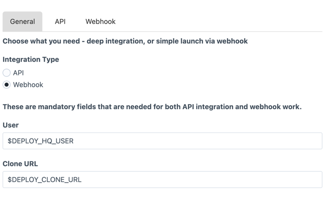
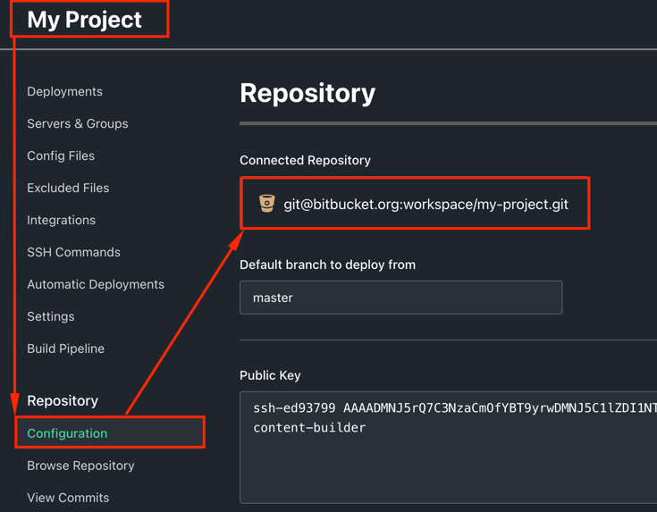
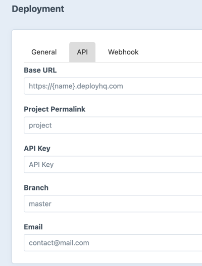
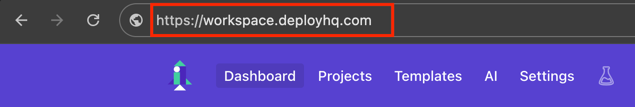
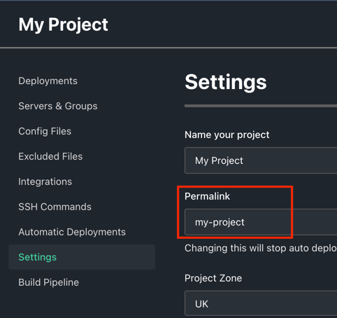
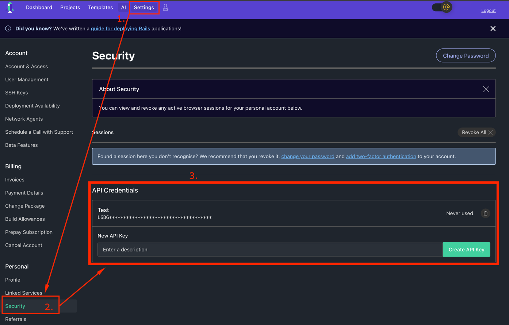
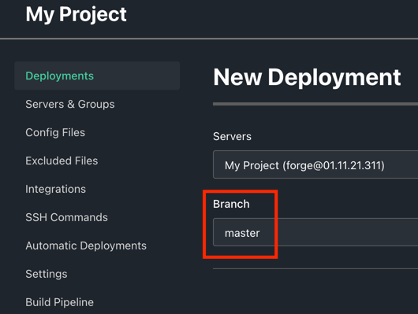
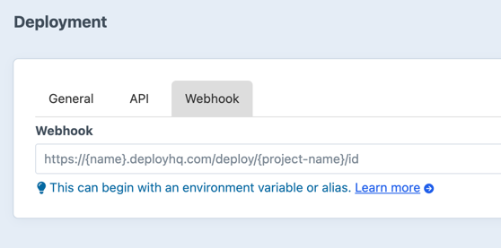
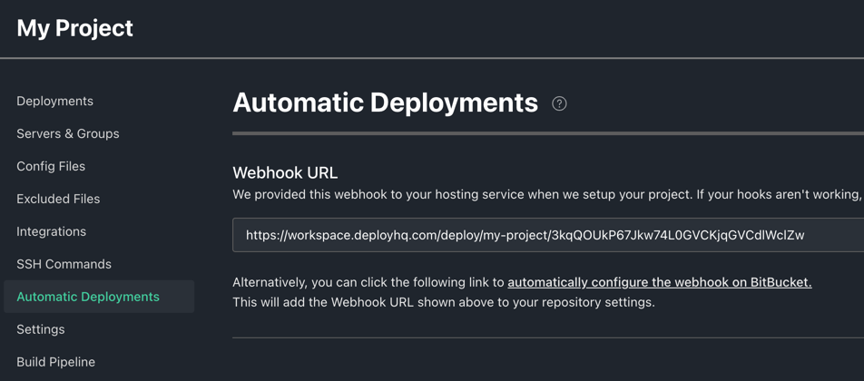

# Full instructions for setting up plugin fields
 Proceed to the cp > settings, click on plugin icon:

## There is three tabs in plugin settings

### 1. General Tab
In the general tab you will see main settings:

### User
Here you paste the e-mail address of your DeployHQ profile

### Clone URL
Clone URL you can find in your project configuration, it's project repository url

### 2. API Tab
Here is fields for API setup

### Base URL
This is the base url of your workspace you can see it in the search bar

### Project Permalink
Project Permalink is located in the project settings

### API Key
Users are provided with an API key which can be found from the “Security” page within the “Settings” menu.

### Branch
The branch you wish to deploy from

### Email
Notification Email

### 3. Webhook Tab
Here is only Webhook field

### Webhook

